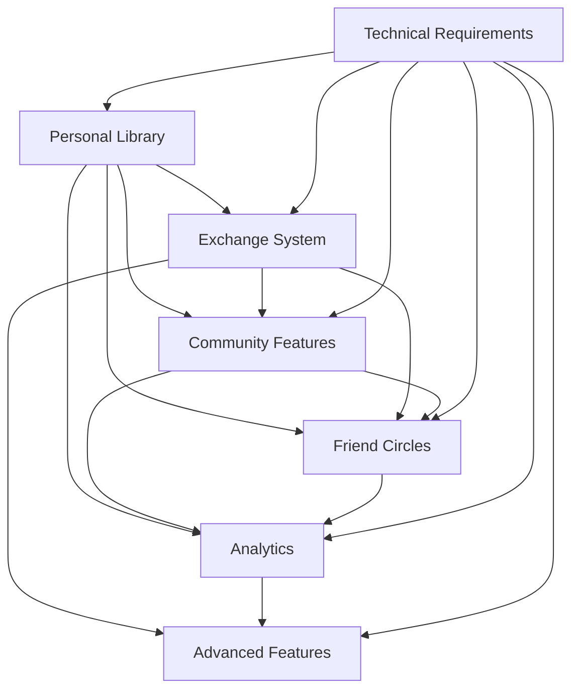

# JigSwap Feature Specifications

This directory contains detailed specifications for each major feature area of the JigSwap platform. Each specification includes user stories, acceptance criteria, and technical requirements.

## Feature Overview

### [Personal Puzzle Library](personal-library.md)

The core personal library management system that allows users to:

- Maintain their puzzle collection with detailed information
- Track multiple completions of the same puzzle
- Record completion times, ratings, and personal reviews
- Organize puzzles with custom categories and visibility levels
- Export personal data and view comprehensive analytics

### [Puzzle Exchange System](puzzle-exchange.md)

The exchange platform that enables various types of puzzle exchanges while preserving personal history:

- **Lending**: Temporary borrowing with return agreements
- **Swapping**: Permanent exchanges between users
- **Trading/Selling**: Direct sales and auctions
- **History Preservation**: Original completion records remain intact
- **New Instance Creation**: New puzzle instances for new owners
- **Complete Ownership Tracking**: Chain of custody for all puzzle instances

### [Community Features](community.md)

Social features that connect puzzle enthusiasts:

- **User Profiles**: Showcase collections and achievements
- **Reviews & Ratings**: Community feedback system
- **Social Discovery**: Find users and puzzles by location
- **Real-time Messaging**: Communication during exchanges
- **Following System**: Track other users' activity

### [Friend Circles](friend-circles.md)

Private group features for trusted puzzle sharing:

- **Private Circles**: Create and manage exclusive friend groups
- **Granular Visibility**: Control puzzle access within specific circles
- **Circle Exchanges**: Exchange puzzles only within trusted circles
- **Permission Management**: Different access levels for circle members
- **Privacy Controls**: Maintain security within friend circles
- **Activity Tracking**: Monitor activity within private circles

### [Analytics and Insights](analytics.md)

Data-driven features for personal and community insights:

- **Personal Analytics**: Completion statistics and trends
- **Community Insights**: Popular puzzles and trends
- **Goal Setting**: Personal completion goals and tracking
- **Data Export**: Backup and analysis capabilities

### [Advanced Features](advanced-features.md)

Enhanced functionality for power users:

- **Condition Tracking**: Document and track puzzle condition
- **Smart Recommendations**: Algorithm-based suggestions
- **Notification System**: Multi-channel alerts and updates
- **Collaborative Filtering**: Discover puzzles and users

### [Technical Requirements](technical-requirements.md)

Platform-wide technical specifications:

- **Performance**: Load times, response times, and scalability
- **Security**: Data protection and privacy controls
- **Usability**: Accessibility and user experience requirements
- **Reliability**: Uptime, backups, and error handling
- **Success Metrics**: Measurable goals for platform success

## Feature Relationships

## Development Priority

1. **Personal Puzzle Library** - Core functionality that all other features depend on
2. **Technical Requirements** - Foundation for reliable platform operation
3. **Puzzle Exchange System** - Primary value proposition for users
4. **Community Features** - Social engagement and discovery
5. **Friend Circles** - Private sharing and trusted group features
6. **Analytics and Insights** - Data-driven user experience
7. **Advanced Features** - Enhanced functionality for power users

## Cross-Feature Dependencies

- **Exchange System** depends on **Personal Library** for puzzle data
- **Community Features** depend on **Personal Library** for user collections
- **Friend Circles** depend on **Personal Library** for puzzle data and **Community Features** for user relationships
- **Analytics** depend on **Personal Library**, **Community Features**, and **Friend Circles** for data
- **Advanced Features** depend on all other features for comprehensive functionality
- **Technical Requirements** support all features with infrastructure and performance

## Implementation Notes

- All features should follow the established technical architecture
- User privacy and data security are paramount across all features
- Real-time updates should be implemented consistently
- Mobile responsiveness is required for all user-facing features
- Internationalization should be considered from the start
